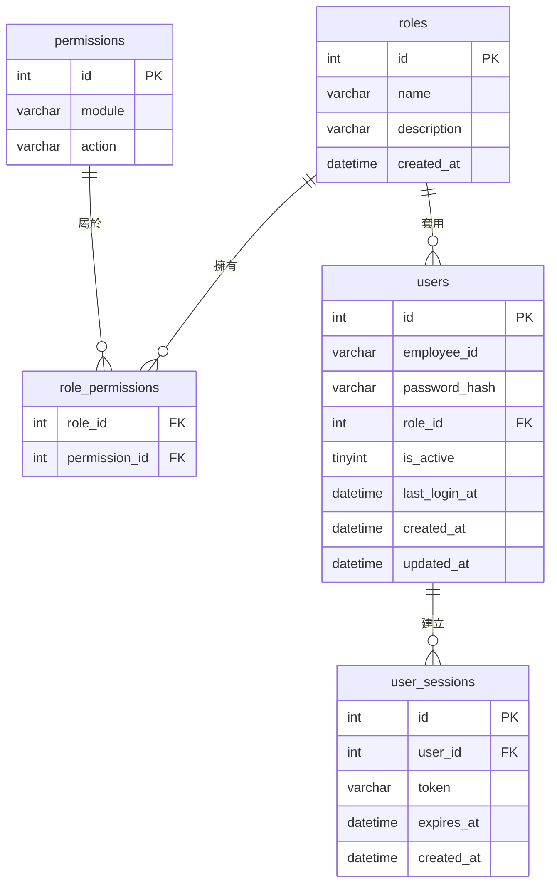
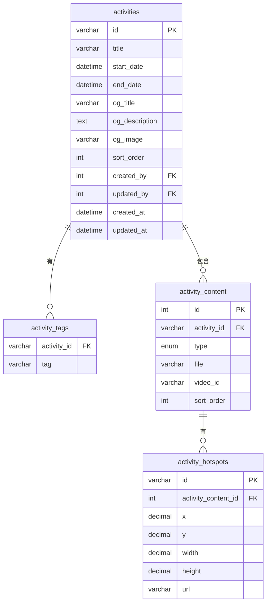
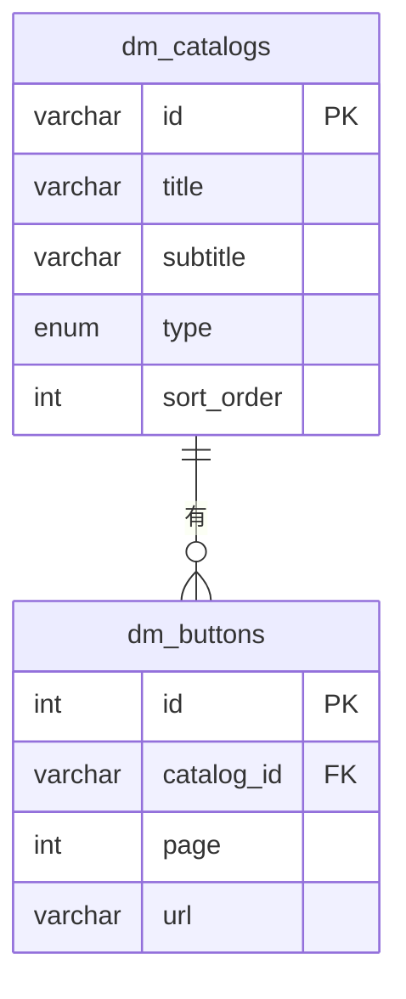
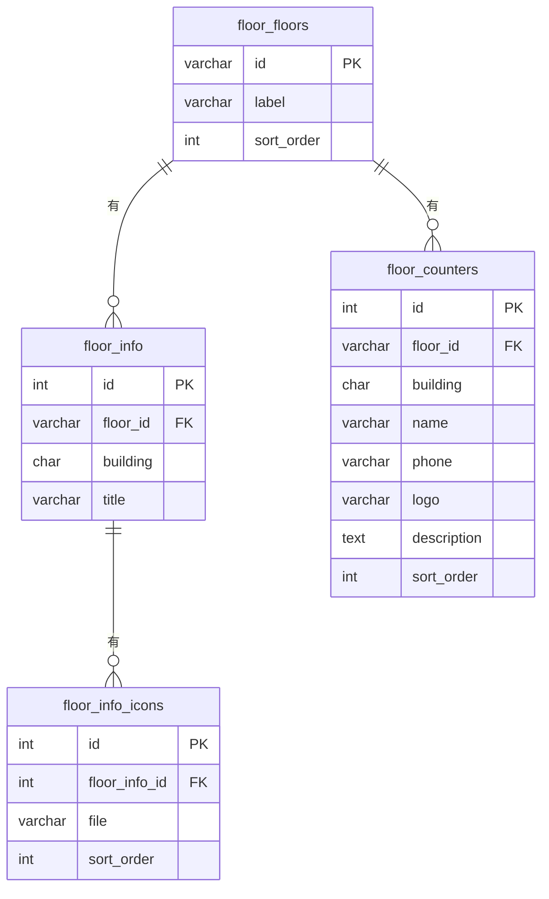
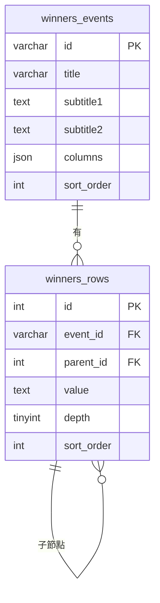
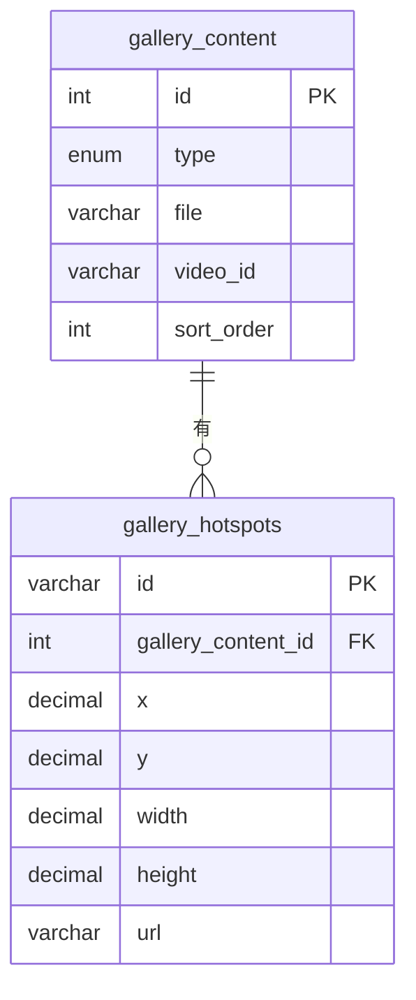
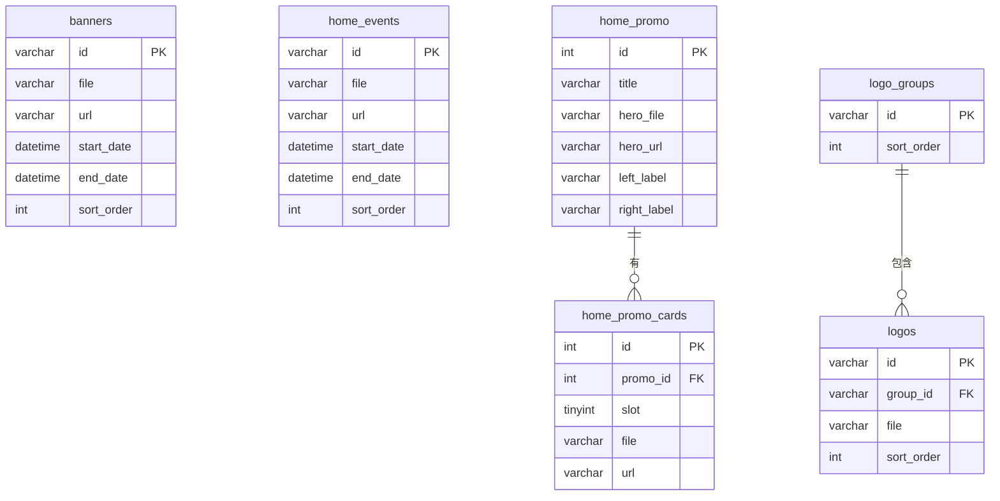
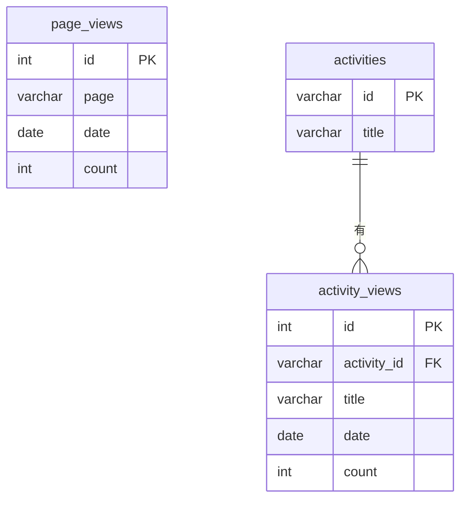

# 中友百貨 CMS — Database Schema & ERD

> 資料庫：MySQL 8.0+
> ORM：Prisma（建議）

---

## 一、帳號權限系統

```sql
-- 角色
CREATE TABLE roles (
  id          INT UNSIGNED AUTO_INCREMENT PRIMARY KEY,
  name        VARCHAR(50)  NOT NULL UNIQUE COMMENT 'super_admin | editor | viewer',
  description VARCHAR(200),
  created_at  DATETIME DEFAULT CURRENT_TIMESTAMP
);

-- 權限（對應每個後台模組）
CREATE TABLE permissions (
  id     INT UNSIGNED AUTO_INCREMENT PRIMARY KEY,
  module VARCHAR(50) NOT NULL COMMENT 'banner | activity | dm | floor | food ...',
  action VARCHAR(20) NOT NULL COMMENT 'read | write',
  UNIQUE KEY uq_perm (module, action)
);

-- 角色權限對照
CREATE TABLE role_permissions (
  role_id       INT UNSIGNED NOT NULL,
  permission_id INT UNSIGNED NOT NULL,
  PRIMARY KEY (role_id, permission_id),
  FOREIGN KEY (role_id)       REFERENCES roles(id)       ON DELETE CASCADE,
  FOREIGN KEY (permission_id) REFERENCES permissions(id) ON DELETE CASCADE
);

-- 使用者
CREATE TABLE users (
  id            INT UNSIGNED AUTO_INCREMENT PRIMARY KEY,
  employee_id   VARCHAR(20)  NOT NULL UNIQUE COMMENT '工號，作為登入帳號',
  password_hash VARCHAR(255) NOT NULL,
  role_id       INT UNSIGNED NOT NULL,
  is_active     TINYINT(1)   DEFAULT 1,
  last_login_at DATETIME,
  created_at    DATETIME DEFAULT CURRENT_TIMESTAMP,
  updated_at    DATETIME DEFAULT CURRENT_TIMESTAMP ON UPDATE CURRENT_TIMESTAMP,
  FOREIGN KEY (role_id) REFERENCES roles(id)
);

-- 登入 Session / Token
CREATE TABLE user_sessions (
  id         INT UNSIGNED AUTO_INCREMENT PRIMARY KEY,
  user_id    INT UNSIGNED NOT NULL,
  token      VARCHAR(255) NOT NULL UNIQUE,
  expires_at DATETIME     NOT NULL,
  created_at DATETIME DEFAULT CURRENT_TIMESTAMP,
  FOREIGN KEY (user_id) REFERENCES users(id) ON DELETE CASCADE
);
```

---

## 二、審計欄位慣例

所有後台可編輯的內容表，一律加上以下四個欄位：

```sql
created_by  INT UNSIGNED COMMENT '新增者 users.id',
updated_by  INT UNSIGNED COMMENT '更新者 users.id',
created_at  DATETIME DEFAULT CURRENT_TIMESTAMP,
updated_at  DATETIME DEFAULT CURRENT_TIMESTAMP ON UPDATE CURRENT_TIMESTAMP,
FOREIGN KEY (created_by) REFERENCES users(id) ON DELETE SET NULL,
FOREIGN KEY (updated_by) REFERENCES users(id) ON DELETE SET NULL
```

---

## 三、內容模組

```sql
-- ── Banner ──────────────────────────────────────────
CREATE TABLE banners (
  id         VARCHAR(50)  PRIMARY KEY,
  file       VARCHAR(255) NOT NULL,
  url        VARCHAR(500),
  start_date DATETIME,
  end_date   DATETIME,
  sort_order INT UNSIGNED DEFAULT 0,
  created_by INT UNSIGNED,
  updated_by INT UNSIGNED,
  created_at DATETIME DEFAULT CURRENT_TIMESTAMP,
  updated_at DATETIME DEFAULT CURRENT_TIMESTAMP ON UPDATE CURRENT_TIMESTAMP,
  FOREIGN KEY (created_by) REFERENCES users(id) ON DELETE SET NULL,
  FOREIGN KEY (updated_by) REFERENCES users(id) ON DELETE SET NULL
);

-- ── 活動頁 ──────────────────────────────────────────
CREATE TABLE activities (
  id             VARCHAR(50)  PRIMARY KEY,
  title          VARCHAR(200) NOT NULL,
  start_date     DATETIME,
  end_date       DATETIME,
  og_title       VARCHAR(200),
  og_description TEXT,
  og_image       VARCHAR(500),
  sort_order     INT UNSIGNED DEFAULT 0,
  created_by     INT UNSIGNED,
  updated_by     INT UNSIGNED,
  created_at     DATETIME DEFAULT CURRENT_TIMESTAMP,
  updated_at     DATETIME DEFAULT CURRENT_TIMESTAMP ON UPDATE CURRENT_TIMESTAMP,
  FOREIGN KEY (created_by) REFERENCES users(id) ON DELETE SET NULL,
  FOREIGN KEY (updated_by) REFERENCES users(id) ON DELETE SET NULL
);

CREATE TABLE activity_tags (
  activity_id VARCHAR(50)  NOT NULL,
  tag         VARCHAR(100) NOT NULL,
  PRIMARY KEY (activity_id, tag),
  FOREIGN KEY (activity_id) REFERENCES activities(id) ON DELETE CASCADE
);

CREATE TABLE activity_content (
  id          INT UNSIGNED AUTO_INCREMENT PRIMARY KEY,
  activity_id VARCHAR(50)  NOT NULL,
  type        ENUM('image','youtube') NOT NULL,
  file        VARCHAR(255),
  video_id    VARCHAR(50),
  sort_order  INT UNSIGNED DEFAULT 0,
  FOREIGN KEY (activity_id) REFERENCES activities(id) ON DELETE CASCADE
);

CREATE TABLE activity_hotspots (
  id                  VARCHAR(50) PRIMARY KEY,
  activity_content_id INT UNSIGNED NOT NULL,
  x                   DECIMAL(10,6) NOT NULL,
  y                   DECIMAL(10,6) NOT NULL,
  width               DECIMAL(10,6) NOT NULL,
  height              DECIMAL(10,6) NOT NULL,
  url                 VARCHAR(500),
  FOREIGN KEY (activity_content_id) REFERENCES activity_content(id) ON DELETE CASCADE
);

-- ── 電子型錄 DM ─────────────────────────────────────
CREATE TABLE dm_catalogs (
  id         VARCHAR(50) PRIMARY KEY,
  title      VARCHAR(200),
  subtitle   VARCHAR(200),
  type       ENUM('double','single','strip') DEFAULT 'double',
  sort_order INT UNSIGNED DEFAULT 0,
  created_by INT UNSIGNED,
  updated_by INT UNSIGNED,
  created_at DATETIME DEFAULT CURRENT_TIMESTAMP,
  updated_at DATETIME DEFAULT CURRENT_TIMESTAMP ON UPDATE CURRENT_TIMESTAMP,
  FOREIGN KEY (created_by) REFERENCES users(id) ON DELETE SET NULL,
  FOREIGN KEY (updated_by) REFERENCES users(id) ON DELETE SET NULL
);

CREATE TABLE dm_buttons (
  id         INT UNSIGNED AUTO_INCREMENT PRIMARY KEY,
  catalog_id VARCHAR(50)  NOT NULL,
  page       INT UNSIGNED NOT NULL,
  url        VARCHAR(500),
  FOREIGN KEY (catalog_id) REFERENCES dm_catalogs(id) ON DELETE CASCADE
);

-- ── 樓層導覽 ────────────────────────────────────────
CREATE TABLE floor_floors (
  id         VARCHAR(20)  PRIMARY KEY,
  label      VARCHAR(100) NOT NULL,
  sort_order INT UNSIGNED DEFAULT 0,
  created_by INT UNSIGNED,
  updated_by INT UNSIGNED,
  created_at DATETIME DEFAULT CURRENT_TIMESTAMP,
  updated_at DATETIME DEFAULT CURRENT_TIMESTAMP ON UPDATE CURRENT_TIMESTAMP,
  FOREIGN KEY (created_by) REFERENCES users(id) ON DELETE SET NULL,
  FOREIGN KEY (updated_by) REFERENCES users(id) ON DELETE SET NULL
);

CREATE TABLE floor_info (
  id         INT UNSIGNED AUTO_INCREMENT PRIMARY KEY,
  floor_id   VARCHAR(20) NOT NULL,
  building   CHAR(1)     NOT NULL COMMENT 'A | B | C',
  title      VARCHAR(200),
  UNIQUE KEY uq_floor_info (floor_id, building),
  FOREIGN KEY (floor_id) REFERENCES floor_floors(id) ON DELETE CASCADE
);

CREATE TABLE floor_info_icons (
  id            INT UNSIGNED AUTO_INCREMENT PRIMARY KEY,
  floor_info_id INT UNSIGNED NOT NULL,
  file          VARCHAR(255) NOT NULL,
  sort_order    INT UNSIGNED DEFAULT 0,
  FOREIGN KEY (floor_info_id) REFERENCES floor_info(id) ON DELETE CASCADE
);

CREATE TABLE floor_counters (
  id          INT UNSIGNED AUTO_INCREMENT PRIMARY KEY,
  floor_id    VARCHAR(20)  NOT NULL,
  building    CHAR(1)      NOT NULL,
  name        VARCHAR(100),
  phone       VARCHAR(50),
  logo        VARCHAR(255),
  description TEXT,
  sort_order  INT UNSIGNED DEFAULT 0,
  FOREIGN KEY (floor_id) REFERENCES floor_floors(id) ON DELETE CASCADE
);

-- ── 美食導覽 ────────────────────────────────────────
CREATE TABLE food_categories (
  id         VARCHAR(50)  PRIMARY KEY,
  label      VARCHAR(100) NOT NULL,
  sort_order INT UNSIGNED DEFAULT 0,
  created_by INT UNSIGNED,
  updated_by INT UNSIGNED,
  created_at DATETIME DEFAULT CURRENT_TIMESTAMP,
  updated_at DATETIME DEFAULT CURRENT_TIMESTAMP ON UPDATE CURRENT_TIMESTAMP,
  FOREIGN KEY (created_by) REFERENCES users(id) ON DELETE SET NULL,
  FOREIGN KEY (updated_by) REFERENCES users(id) ON DELETE SET NULL
);

CREATE TABLE food_items (
  id          INT UNSIGNED AUTO_INCREMENT PRIMARY KEY,
  category_id VARCHAR(50)  NOT NULL,
  name        VARCHAR(200) NOT NULL,
  floor       VARCHAR(20),
  building    CHAR(1),
  phone       VARCHAR(50),
  logo        VARCHAR(255),
  description TEXT,
  sort_order  INT UNSIGNED DEFAULT 0,
  FOREIGN KEY (category_id) REFERENCES food_categories(id) ON DELETE CASCADE
);

-- ── 得獎名單 ────────────────────────────────────────
CREATE TABLE winners_events (
  id         VARCHAR(50) PRIMARY KEY,
  title      VARCHAR(200),
  subtitle1  TEXT,
  subtitle2  TEXT,
  columns    JSON COMMENT '固定 5 欄名稱陣列',
  sort_order INT UNSIGNED DEFAULT 0,
  created_by INT UNSIGNED,
  updated_by INT UNSIGNED,
  created_at DATETIME DEFAULT CURRENT_TIMESTAMP,
  updated_at DATETIME DEFAULT CURRENT_TIMESTAMP ON UPDATE CURRENT_TIMESTAMP,
  FOREIGN KEY (created_by) REFERENCES users(id) ON DELETE SET NULL,
  FOREIGN KEY (updated_by) REFERENCES users(id) ON DELETE SET NULL
);

CREATE TABLE winners_rows (
  id         INT UNSIGNED AUTO_INCREMENT PRIMARY KEY,
  event_id   VARCHAR(50)  NOT NULL,
  parent_id  INT UNSIGNED COMMENT 'NULL = root',
  value      TEXT,
  depth      TINYINT UNSIGNED DEFAULT 0,
  sort_order INT UNSIGNED DEFAULT 0,
  FOREIGN KEY (event_id)  REFERENCES winners_events(id) ON DELETE CASCADE,
  FOREIGN KEY (parent_id) REFERENCES winners_rows(id)   ON DELETE CASCADE
);

-- ── 時尚藝廊 ────────────────────────────────────────
CREATE TABLE gallery_content (
  id         INT UNSIGNED AUTO_INCREMENT PRIMARY KEY,
  type       ENUM('image','youtube') NOT NULL,
  file       VARCHAR(255),
  video_id   VARCHAR(50),
  sort_order INT UNSIGNED DEFAULT 0,
  created_by INT UNSIGNED,
  updated_by INT UNSIGNED,
  created_at DATETIME DEFAULT CURRENT_TIMESTAMP,
  updated_at DATETIME DEFAULT CURRENT_TIMESTAMP ON UPDATE CURRENT_TIMESTAMP,
  FOREIGN KEY (created_by) REFERENCES users(id) ON DELETE SET NULL,
  FOREIGN KEY (updated_by) REFERENCES users(id) ON DELETE SET NULL
);

CREATE TABLE gallery_hotspots (
  id                 VARCHAR(50) PRIMARY KEY,
  gallery_content_id INT UNSIGNED  NOT NULL,
  x                  DECIMAL(10,6),
  y                  DECIMAL(10,6),
  width              DECIMAL(10,6),
  height             DECIMAL(10,6),
  url                VARCHAR(500),
  FOREIGN KEY (gallery_content_id) REFERENCES gallery_content(id) ON DELETE CASCADE
);

-- ── 首頁活動訊息 ─────────────────────────────────────
CREATE TABLE home_events (
  id         VARCHAR(50)  PRIMARY KEY,
  file       VARCHAR(255) NOT NULL,
  url        VARCHAR(500),
  start_date DATETIME,
  end_date   DATETIME,
  sort_order INT UNSIGNED DEFAULT 0,
  created_by INT UNSIGNED,
  updated_by INT UNSIGNED,
  created_at DATETIME DEFAULT CURRENT_TIMESTAMP,
  updated_at DATETIME DEFAULT CURRENT_TIMESTAMP ON UPDATE CURRENT_TIMESTAMP,
  FOREIGN KEY (created_by) REFERENCES users(id) ON DELETE SET NULL,
  FOREIGN KEY (updated_by) REFERENCES users(id) ON DELETE SET NULL
);

-- ── 首頁促銷區 ──────────────────────────────────────
CREATE TABLE home_promo (
  id          INT UNSIGNED AUTO_INCREMENT PRIMARY KEY,
  title       VARCHAR(200),
  hero_file   VARCHAR(255),
  hero_url    VARCHAR(500),
  left_label  VARCHAR(100),
  right_label VARCHAR(100),
  created_by  INT UNSIGNED,
  updated_by  INT UNSIGNED,
  created_at  DATETIME DEFAULT CURRENT_TIMESTAMP,
  updated_at  DATETIME DEFAULT CURRENT_TIMESTAMP ON UPDATE CURRENT_TIMESTAMP,
  FOREIGN KEY (created_by) REFERENCES users(id) ON DELETE SET NULL,
  FOREIGN KEY (updated_by) REFERENCES users(id) ON DELETE SET NULL
);

CREATE TABLE home_promo_cards (
  id       INT UNSIGNED AUTO_INCREMENT PRIMARY KEY,
  promo_id INT UNSIGNED    NOT NULL,
  slot     TINYINT UNSIGNED NOT NULL,
  file     VARCHAR(255),
  url      VARCHAR(500),
  FOREIGN KEY (promo_id) REFERENCES home_promo(id) ON DELETE CASCADE
);

-- ── Logo 跑馬燈 ──────────────────────────────────────
CREATE TABLE logo_groups (
  id         VARCHAR(50) PRIMARY KEY,
  sort_order INT UNSIGNED DEFAULT 0,
  created_by INT UNSIGNED,
  updated_by INT UNSIGNED,
  created_at DATETIME DEFAULT CURRENT_TIMESTAMP,
  updated_at DATETIME DEFAULT CURRENT_TIMESTAMP ON UPDATE CURRENT_TIMESTAMP,
  FOREIGN KEY (created_by) REFERENCES users(id) ON DELETE SET NULL,
  FOREIGN KEY (updated_by) REFERENCES users(id) ON DELETE SET NULL
);

CREATE TABLE logos (
  id         VARCHAR(50)  PRIMARY KEY,
  group_id   VARCHAR(50)  NOT NULL,
  file       VARCHAR(255) NOT NULL,
  sort_order INT UNSIGNED DEFAULT 0,
  FOREIGN KEY (group_id) REFERENCES logo_groups(id) ON DELETE CASCADE
);

-- ── 系統設定（Key-Value）────────────────────────────
CREATE TABLE config (
  key_name   VARCHAR(100) PRIMARY KEY,
  value      TEXT,
  created_by INT UNSIGNED,
  updated_by INT UNSIGNED,
  created_at DATETIME DEFAULT CURRENT_TIMESTAMP,
  updated_at DATETIME DEFAULT CURRENT_TIMESTAMP ON UPDATE CURRENT_TIMESTAMP,
  FOREIGN KEY (created_by) REFERENCES users(id) ON DELETE SET NULL,
  FOREIGN KEY (updated_by) REFERENCES users(id) ON DELETE SET NULL
);

-- ── 流量統計 ────────────────────────────────────────
-- 追蹤頁面：home | floor | food | service | winners | feedback | activity
CREATE TABLE page_views (
  id      INT UNSIGNED AUTO_INCREMENT PRIMARY KEY,
  page    VARCHAR(50) NOT NULL COMMENT 'home|floor|food|service|winners|feedback|activity',
  date    DATE        NOT NULL,
  count   INT UNSIGNED DEFAULT 0,
  UNIQUE KEY uq_page_date (page, date)
);

-- 活動頁個別瀏覽統計
CREATE TABLE activity_views (
  id          INT UNSIGNED AUTO_INCREMENT PRIMARY KEY,
  activity_id VARCHAR(50)  NOT NULL,
  title       VARCHAR(200),
  date        DATE         NOT NULL,
  count       INT UNSIGNED DEFAULT 0,
  UNIQUE KEY uq_act_date (activity_id, date),
  FOREIGN KEY (activity_id) REFERENCES activities(id) ON DELETE CASCADE
);
```

---

## 三、權限模組清單

| module         | 說明             |
|----------------|------------------|
| `banner`       | 首頁 Banner      |
| `home_event`   | 首頁活動訊息     |
| `home_promo`   | 首頁促銷         |
| `home_fb`      | 首頁 Facebook    |
| `logo`         | Logo 跑馬燈      |
| `dm`           | 電子型錄 DM      |
| `floor`        | 樓層導覽         |
| `food`         | 美食導覽         |
| `winners`      | 得獎名單         |
| `activity`     | 活動頁           |
| `gallery`      | 時尚藝廊         |
| `service`      | 貼心服務         |
| `sustainability` | 永續報告書     |
| `config`       | 系統設定（super_admin 限定）|
| `user`         | 帳號管理（super_admin 限定）|
| `stats`        | 流量統計（super_admin 限定）|

### 預設角色權限

| 角色          | 權限範圍                                    |
|---------------|---------------------------------------------|
| `super_admin` | 全部模組 read + write                       |
| `editor`      | 除 `user`、`config` 外所有模組 read + write |
| `viewer`      | 所有模組 read only                          |

---

## 四、ERD 圖（分組顯示）

### 4-1 帳號權限系統



---

### 4-2 活動頁

> 所有內容表均含審計欄位：`created_by FK` / `updated_by FK` / `created_at` / `updated_at`



---

### 4-3 電子型錄 DM



---

### 4-4 樓層導覽



---

### 4-5 美食導覽


---

### 4-6 得獎名單



---

### 4-7 時尚藝廊



---

### 4-8 首頁模組



---

### 4-9 流量統計


