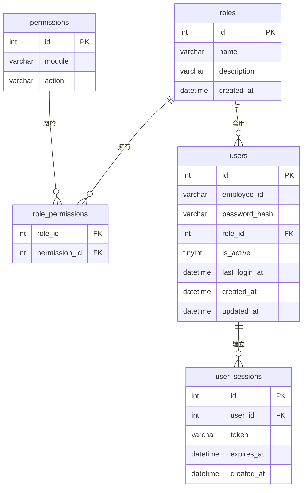
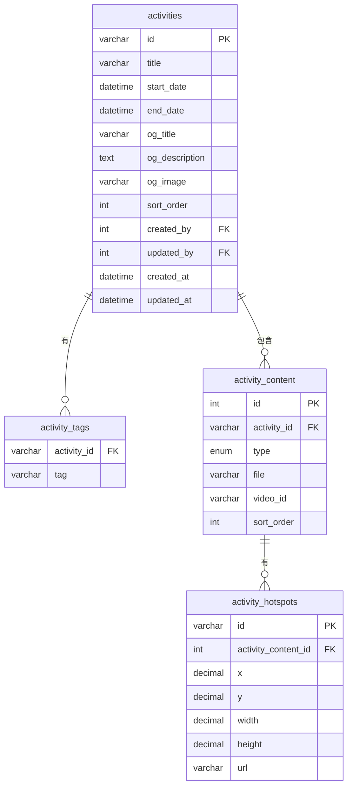
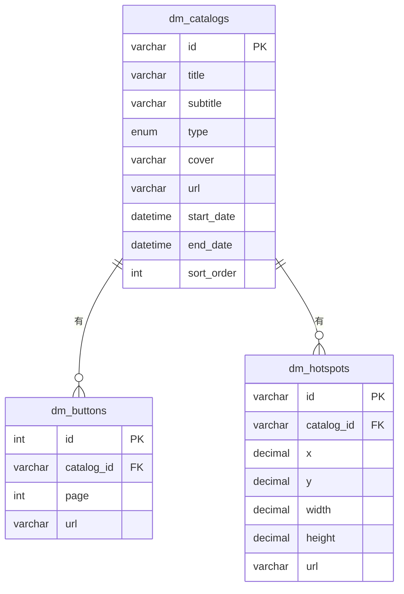
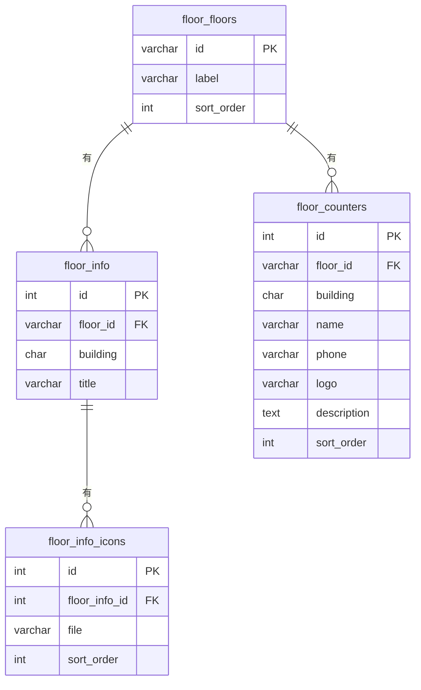
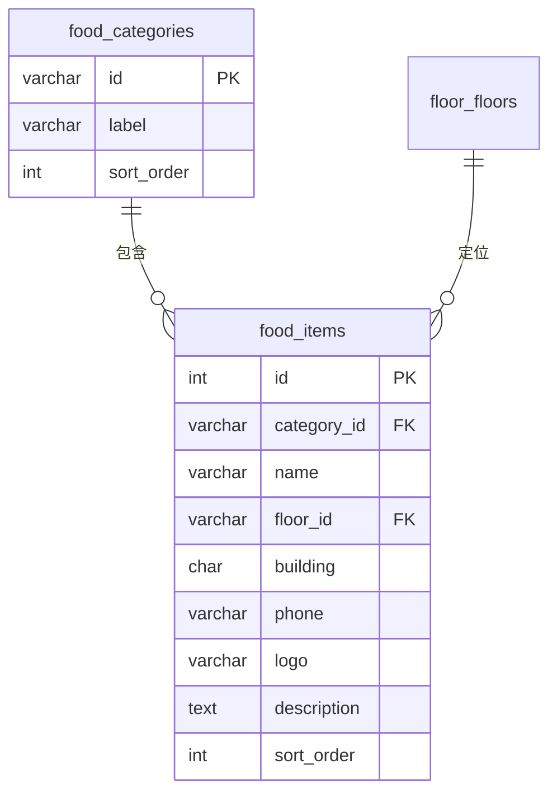
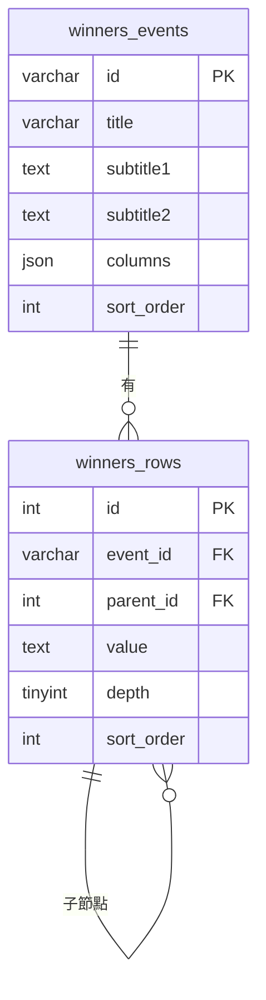
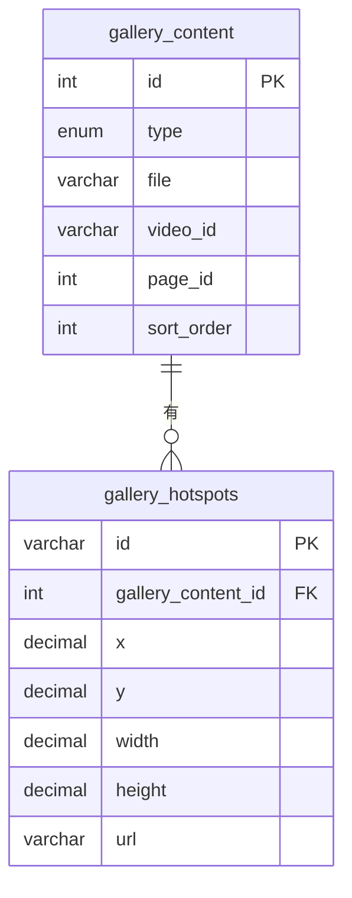
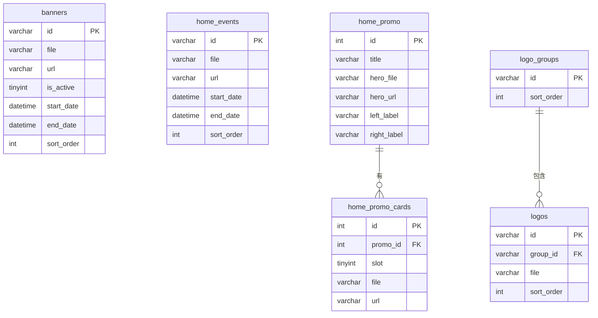
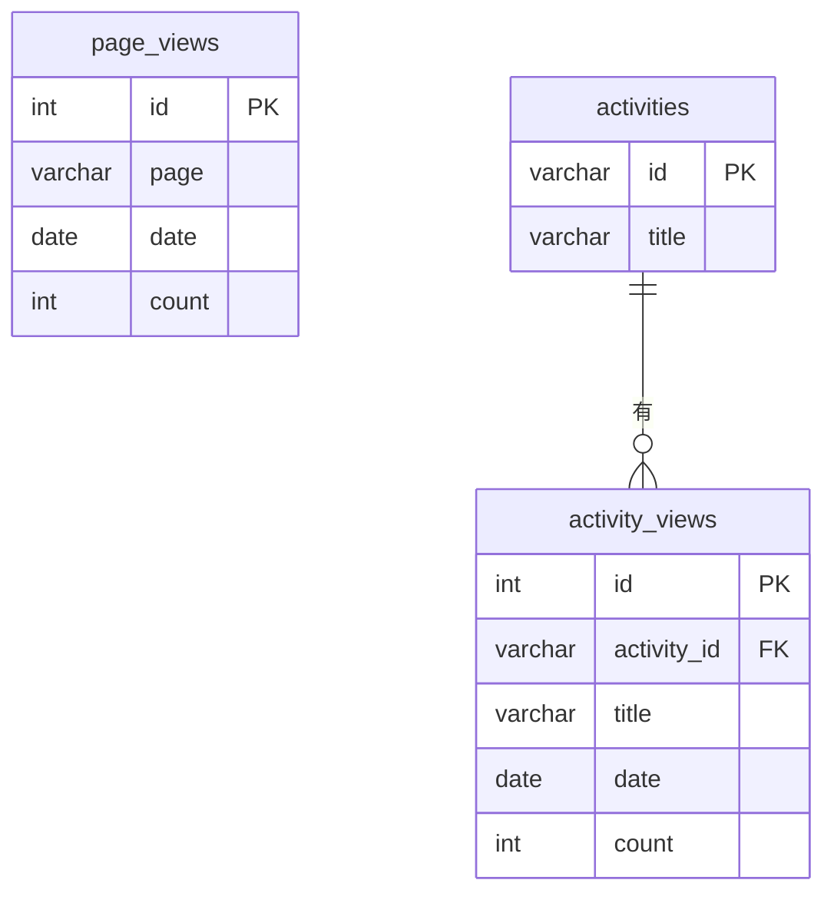

# 中友百貨 CMS — Database Schema & ERD

> 資料庫：MySQL 8.0+
> ORM：Prisma（建議）

---

## 一、帳號權限系統

```sql
-- 角色
CREATE TABLE roles (
  id          INT UNSIGNED AUTO_INCREMENT PRIMARY KEY,
  name        VARCHAR(50)  NOT NULL UNIQUE COMMENT 'super_admin | editor | viewer',
  description VARCHAR(200),
  created_at  DATETIME DEFAULT CURRENT_TIMESTAMP
);

-- 權限（對應每個後台模組）
CREATE TABLE permissions (
  id     INT UNSIGNED AUTO_INCREMENT PRIMARY KEY,
  module VARCHAR(50) NOT NULL COMMENT 'banner | activity | dm | floor | food ...',
  action VARCHAR(20) NOT NULL COMMENT 'read | write',
  UNIQUE KEY uq_perm (module, action)
);

-- 角色權限對照
CREATE TABLE role_permissions (
  role_id       INT UNSIGNED NOT NULL,
  permission_id INT UNSIGNED NOT NULL,
  PRIMARY KEY (role_id, permission_id),
  FOREIGN KEY (role_id)       REFERENCES roles(id)       ON DELETE CASCADE,
  FOREIGN KEY (permission_id) REFERENCES permissions(id) ON DELETE CASCADE
);

-- 使用者
CREATE TABLE users (
  id            INT UNSIGNED AUTO_INCREMENT PRIMARY KEY,
  employee_id   VARCHAR(20)  NOT NULL UNIQUE COMMENT '工號，作為登入帳號',
  password_hash VARCHAR(255) NOT NULL,
  role_id       INT UNSIGNED NOT NULL,
  is_active     TINYINT(1)   DEFAULT 1,
  last_login_at DATETIME,
  created_at    DATETIME DEFAULT CURRENT_TIMESTAMP,
  updated_at    DATETIME DEFAULT CURRENT_TIMESTAMP ON UPDATE CURRENT_TIMESTAMP,
  FOREIGN KEY (role_id) REFERENCES roles(id)
);

-- 登入 Session / Token
CREATE TABLE user_sessions (
  id         INT UNSIGNED AUTO_INCREMENT PRIMARY KEY,
  user_id    INT UNSIGNED NOT NULL,
  token      VARCHAR(255) NOT NULL UNIQUE,
  expires_at DATETIME     NOT NULL,
  created_at DATETIME DEFAULT CURRENT_TIMESTAMP,
  FOREIGN KEY (user_id) REFERENCES users(id) ON DELETE CASCADE
);
```

---

## 二、審計欄位慣例

所有後台可編輯的內容表，一律加上以下四個欄位：

```sql
created_by  INT UNSIGNED COMMENT '新增者 users.id',
updated_by  INT UNSIGNED COMMENT '更新者 users.id',
created_at  DATETIME DEFAULT CURRENT_TIMESTAMP,
updated_at  DATETIME DEFAULT CURRENT_TIMESTAMP ON UPDATE CURRENT_TIMESTAMP,
FOREIGN KEY (created_by) REFERENCES users(id) ON DELETE SET NULL,
FOREIGN KEY (updated_by) REFERENCES users(id) ON DELETE SET NULL
```

---

## 三、內容模組

```sql
-- ── Banner ──────────────────────────────────────────
CREATE TABLE banners (
  id         VARCHAR(50)  PRIMARY KEY,
  file       VARCHAR(255) NOT NULL,
  url        VARCHAR(500),
  is_active  TINYINT(1)   DEFAULT 1,
  start_date DATETIME,
  end_date   DATETIME,
  sort_order INT UNSIGNED DEFAULT 0,
  created_by INT UNSIGNED,
  updated_by INT UNSIGNED,
  created_at DATETIME DEFAULT CURRENT_TIMESTAMP,
  updated_at DATETIME DEFAULT CURRENT_TIMESTAMP ON UPDATE CURRENT_TIMESTAMP,
  FOREIGN KEY (created_by) REFERENCES users(id) ON DELETE SET NULL,
  FOREIGN KEY (updated_by) REFERENCES users(id) ON DELETE SET NULL
);

-- ── 活動頁 ──────────────────────────────────────────
CREATE TABLE activities (
  id             VARCHAR(50)  PRIMARY KEY,
  title          VARCHAR(200) NOT NULL,
  start_date     DATETIME,
  end_date       DATETIME,
  og_title       VARCHAR(200),
  og_description TEXT,
  og_image       VARCHAR(500),
  sort_order     INT UNSIGNED DEFAULT 0,
  created_by     INT UNSIGNED,
  updated_by     INT UNSIGNED,
  created_at     DATETIME DEFAULT CURRENT_TIMESTAMP,
  updated_at     DATETIME DEFAULT CURRENT_TIMESTAMP ON UPDATE CURRENT_TIMESTAMP,
  FOREIGN KEY (created_by) REFERENCES users(id) ON DELETE SET NULL,
  FOREIGN KEY (updated_by) REFERENCES users(id) ON DELETE SET NULL
);

CREATE TABLE activity_tags (
  activity_id VARCHAR(50)  NOT NULL,
  tag         VARCHAR(100) NOT NULL,
  PRIMARY KEY (activity_id, tag),
  FOREIGN KEY (activity_id) REFERENCES activities(id) ON DELETE CASCADE
);

CREATE TABLE activity_content (
  id          INT UNSIGNED AUTO_INCREMENT PRIMARY KEY,
  activity_id VARCHAR(50)  NOT NULL,
  type        ENUM('image','youtube') NOT NULL,
  file        VARCHAR(255),
  video_id    VARCHAR(50),
  sort_order  INT UNSIGNED DEFAULT 0,
  FOREIGN KEY (activity_id) REFERENCES activities(id) ON DELETE CASCADE
);

CREATE TABLE activity_hotspots (
  id                  VARCHAR(50) PRIMARY KEY,
  activity_content_id INT UNSIGNED NOT NULL,
  x                   DECIMAL(10,6) NOT NULL,
  y                   DECIMAL(10,6) NOT NULL,
  width               DECIMAL(10,6) NOT NULL,
  height              DECIMAL(10,6) NOT NULL,
  url                 VARCHAR(500),
  FOREIGN KEY (activity_content_id) REFERENCES activity_content(id) ON DELETE CASCADE
);

-- ── 電子型錄 DM ─────────────────────────────────────
CREATE TABLE dm_catalogs (
  id         VARCHAR(50)  PRIMARY KEY,
  title      VARCHAR(200),
  subtitle   VARCHAR(200),
  type       ENUM('double','single','strip','url') DEFAULT 'double',
  cover      VARCHAR(255),
  url        VARCHAR(500),
  start_date DATETIME,
  end_date   DATETIME,
  sort_order INT UNSIGNED DEFAULT 0,
  created_by INT UNSIGNED,
  updated_by INT UNSIGNED,
  created_at DATETIME DEFAULT CURRENT_TIMESTAMP,
  updated_at DATETIME DEFAULT CURRENT_TIMESTAMP ON UPDATE CURRENT_TIMESTAMP,
  FOREIGN KEY (created_by) REFERENCES users(id) ON DELETE SET NULL,
  FOREIGN KEY (updated_by) REFERENCES users(id) ON DELETE SET NULL
);

-- double / single 版型用
CREATE TABLE dm_buttons (
  id         INT UNSIGNED AUTO_INCREMENT PRIMARY KEY,
  catalog_id VARCHAR(50)  NOT NULL,
  page       INT UNSIGNED NOT NULL,
  url        VARCHAR(500),
  FOREIGN KEY (catalog_id) REFERENCES dm_catalogs(id) ON DELETE CASCADE
);

-- strip 版型用
CREATE TABLE dm_hotspots (
  id         VARCHAR(50)   PRIMARY KEY,
  catalog_id VARCHAR(50)   NOT NULL,
  x          DECIMAL(10,6) NOT NULL,
  y          DECIMAL(10,6) NOT NULL,
  width      DECIMAL(10,6) NOT NULL,
  height     DECIMAL(10,6) NOT NULL,
  url        VARCHAR(500),
  FOREIGN KEY (catalog_id) REFERENCES dm_catalogs(id) ON DELETE CASCADE
);

-- ── 樓層導覽 ────────────────────────────────────────
CREATE TABLE floor_floors (
  id         VARCHAR(20)  PRIMARY KEY,
  label      VARCHAR(100) NOT NULL,
  sort_order INT UNSIGNED DEFAULT 0,
  created_by INT UNSIGNED,
  updated_by INT UNSIGNED,
  created_at DATETIME DEFAULT CURRENT_TIMESTAMP,
  updated_at DATETIME DEFAULT CURRENT_TIMESTAMP ON UPDATE CURRENT_TIMESTAMP,
  FOREIGN KEY (created_by) REFERENCES users(id) ON DELETE SET NULL,
  FOREIGN KEY (updated_by) REFERENCES users(id) ON DELETE SET NULL
);

CREATE TABLE floor_info (
  id         INT UNSIGNED AUTO_INCREMENT PRIMARY KEY,
  floor_id   VARCHAR(20) NOT NULL,
  building   CHAR(1)     NOT NULL COMMENT 'A | B | C',
  title      VARCHAR(200),
  UNIQUE KEY uq_floor_info (floor_id, building),
  FOREIGN KEY (floor_id) REFERENCES floor_floors(id) ON DELETE CASCADE
);

CREATE TABLE floor_info_icons (
  id            INT UNSIGNED AUTO_INCREMENT PRIMARY KEY,
  floor_info_id INT UNSIGNED NOT NULL,
  file          VARCHAR(255) NOT NULL,
  sort_order    INT UNSIGNED DEFAULT 0,
  FOREIGN KEY (floor_info_id) REFERENCES floor_info(id) ON DELETE CASCADE
);

CREATE TABLE floor_counters (
  id          INT UNSIGNED AUTO_INCREMENT PRIMARY KEY,
  floor_id    VARCHAR(20)  NOT NULL,
  building    CHAR(1)      NOT NULL,
  name        VARCHAR(100),
  phone       VARCHAR(50),
  logo        VARCHAR(255),
  description TEXT,
  sort_order  INT UNSIGNED DEFAULT 0,
  FOREIGN KEY (floor_id) REFERENCES floor_floors(id) ON DELETE CASCADE
);

-- ── 美食導覽 ────────────────────────────────────────
CREATE TABLE food_categories (
  id         VARCHAR(50)  PRIMARY KEY,
  label      VARCHAR(100) NOT NULL,
  sort_order INT UNSIGNED DEFAULT 0,
  created_by INT UNSIGNED,
  updated_by INT UNSIGNED,
  created_at DATETIME DEFAULT CURRENT_TIMESTAMP,
  updated_at DATETIME DEFAULT CURRENT_TIMESTAMP ON UPDATE CURRENT_TIMESTAMP,
  FOREIGN KEY (created_by) REFERENCES users(id) ON DELETE SET NULL,
  FOREIGN KEY (updated_by) REFERENCES users(id) ON DELETE SET NULL
);

CREATE TABLE food_items (
  id          INT UNSIGNED AUTO_INCREMENT PRIMARY KEY,
  category_id VARCHAR(50)  NOT NULL,
  name        VARCHAR(200) NOT NULL,
  floor_id    VARCHAR(20),
  building    CHAR(1)      COMMENT 'A | B | C',
  phone       VARCHAR(50),
  logo        VARCHAR(255),
  description TEXT,
  sort_order  INT UNSIGNED DEFAULT 0,
  FOREIGN KEY (category_id) REFERENCES food_categories(id) ON DELETE CASCADE,
  FOREIGN KEY (floor_id)    REFERENCES floor_floors(id)    ON DELETE SET NULL
);

-- ── 得獎名單 ────────────────────────────────────────
CREATE TABLE winners_events (
  id         VARCHAR(50) PRIMARY KEY,
  title      VARCHAR(200),
  subtitle1  TEXT,
  subtitle2  TEXT,
  columns    JSON COMMENT '固定 5 欄名稱陣列',
  sort_order INT UNSIGNED DEFAULT 0,
  created_by INT UNSIGNED,
  updated_by INT UNSIGNED,
  created_at DATETIME DEFAULT CURRENT_TIMESTAMP,
  updated_at DATETIME DEFAULT CURRENT_TIMESTAMP ON UPDATE CURRENT_TIMESTAMP,
  FOREIGN KEY (created_by) REFERENCES users(id) ON DELETE SET NULL,
  FOREIGN KEY (updated_by) REFERENCES users(id) ON DELETE SET NULL
);

CREATE TABLE winners_rows (
  id         INT UNSIGNED AUTO_INCREMENT PRIMARY KEY,
  event_id   VARCHAR(50)  NOT NULL,
  parent_id  INT UNSIGNED COMMENT 'NULL = root',
  value      TEXT,
  depth      TINYINT UNSIGNED DEFAULT 0,
  sort_order INT UNSIGNED DEFAULT 0,
  FOREIGN KEY (event_id)  REFERENCES winners_events(id) ON DELETE CASCADE,
  FOREIGN KEY (parent_id) REFERENCES winners_rows(id)   ON DELETE CASCADE
);

-- ── 時尚藝廊 ────────────────────────────────────────
CREATE TABLE gallery_content (
  id         INT UNSIGNED AUTO_INCREMENT PRIMARY KEY,
  type       ENUM('image','youtube') NOT NULL,
  file       VARCHAR(255),
  video_id   VARCHAR(50),
  page_id    INT UNSIGNED NULL COMMENT '預留：未來多分頁用，NULL = 預設共用頁',
  sort_order INT UNSIGNED DEFAULT 0,
  created_by INT UNSIGNED,
  updated_by INT UNSIGNED,
  created_at DATETIME DEFAULT CURRENT_TIMESTAMP,
  updated_at DATETIME DEFAULT CURRENT_TIMESTAMP ON UPDATE CURRENT_TIMESTAMP,
  FOREIGN KEY (created_by) REFERENCES users(id) ON DELETE SET NULL,
  FOREIGN KEY (updated_by) REFERENCES users(id) ON DELETE SET NULL
);

CREATE TABLE gallery_hotspots (
  id                 VARCHAR(50) PRIMARY KEY,
  gallery_content_id INT UNSIGNED  NOT NULL,
  x                  DECIMAL(10,6),
  y                  DECIMAL(10,6),
  width              DECIMAL(10,6),
  height             DECIMAL(10,6),
  url                VARCHAR(500),
  FOREIGN KEY (gallery_content_id) REFERENCES gallery_content(id) ON DELETE CASCADE
);

-- ── 首頁活動訊息 ─────────────────────────────────────
CREATE TABLE home_events (
  id         VARCHAR(50)  PRIMARY KEY,
  file       VARCHAR(255) NOT NULL,
  url        VARCHAR(500),
  start_date DATETIME,
  end_date   DATETIME,
  sort_order INT UNSIGNED DEFAULT 0,
  created_by INT UNSIGNED,
  updated_by INT UNSIGNED,
  created_at DATETIME DEFAULT CURRENT_TIMESTAMP,
  updated_at DATETIME DEFAULT CURRENT_TIMESTAMP ON UPDATE CURRENT_TIMESTAMP,
  FOREIGN KEY (created_by) REFERENCES users(id) ON DELETE SET NULL,
  FOREIGN KEY (updated_by) REFERENCES users(id) ON DELETE SET NULL
);

-- ── 首頁促銷區 ──────────────────────────────────────
CREATE TABLE home_promo (
  id          INT UNSIGNED AUTO_INCREMENT PRIMARY KEY,
  title       VARCHAR(200),
  hero_file   VARCHAR(255),
  hero_url    VARCHAR(500),
  left_label  VARCHAR(100),
  right_label VARCHAR(100),
  created_by  INT UNSIGNED,
  updated_by  INT UNSIGNED,
  created_at  DATETIME DEFAULT CURRENT_TIMESTAMP,
  updated_at  DATETIME DEFAULT CURRENT_TIMESTAMP ON UPDATE CURRENT_TIMESTAMP,
  FOREIGN KEY (created_by) REFERENCES users(id) ON DELETE SET NULL,
  FOREIGN KEY (updated_by) REFERENCES users(id) ON DELETE SET NULL
);

CREATE TABLE home_promo_cards (
  id       INT UNSIGNED AUTO_INCREMENT PRIMARY KEY,
  promo_id INT UNSIGNED    NOT NULL,
  slot     TINYINT UNSIGNED NOT NULL,
  file     VARCHAR(255),
  url      VARCHAR(500),
  FOREIGN KEY (promo_id) REFERENCES home_promo(id) ON DELETE CASCADE
);

-- ── Logo 跑馬燈 ──────────────────────────────────────
CREATE TABLE logo_groups (
  id         VARCHAR(50) PRIMARY KEY,
  sort_order INT UNSIGNED DEFAULT 0,
  created_by INT UNSIGNED,
  updated_by INT UNSIGNED,
  created_at DATETIME DEFAULT CURRENT_TIMESTAMP,
  updated_at DATETIME DEFAULT CURRENT_TIMESTAMP ON UPDATE CURRENT_TIMESTAMP,
  FOREIGN KEY (created_by) REFERENCES users(id) ON DELETE SET NULL,
  FOREIGN KEY (updated_by) REFERENCES users(id) ON DELETE SET NULL
);

CREATE TABLE logos (
  id         VARCHAR(50)  PRIMARY KEY,
  group_id   VARCHAR(50)  NOT NULL,
  file       VARCHAR(255) NOT NULL,
  sort_order INT UNSIGNED DEFAULT 0,
  FOREIGN KEY (group_id) REFERENCES logo_groups(id) ON DELETE CASCADE
);

-- ── 系統設定（Key-Value）────────────────────────────
CREATE TABLE config (
  key_name   VARCHAR(100) PRIMARY KEY,
  value      TEXT,
  created_by INT UNSIGNED,
  updated_by INT UNSIGNED,
  created_at DATETIME DEFAULT CURRENT_TIMESTAMP,
  updated_at DATETIME DEFAULT CURRENT_TIMESTAMP ON UPDATE CURRENT_TIMESTAMP,
  FOREIGN KEY (created_by) REFERENCES users(id) ON DELETE SET NULL,
  FOREIGN KEY (updated_by) REFERENCES users(id) ON DELETE SET NULL
);

-- ── 流量統計 ────────────────────────────────────────
-- 追蹤頁面：home | floor | food | service | winners | feedback | activity
CREATE TABLE page_views (
  id      INT UNSIGNED AUTO_INCREMENT PRIMARY KEY,
  page    VARCHAR(50)      NOT NULL COMMENT 'home|floor|food|service|winners|feedback|activity',
  date    DATE             NOT NULL,
  hour    TINYINT UNSIGNED NULL COMMENT '預留：0-23，NULL = 日粒度（未啟用時段分析）',
  count   INT UNSIGNED DEFAULT 0,
  UNIQUE KEY uq_page_date (page, date)
);

-- 活動頁個別瀏覽統計
CREATE TABLE activity_views (
  id          INT UNSIGNED AUTO_INCREMENT PRIMARY KEY,
  activity_id VARCHAR(50)      NOT NULL,
  title       VARCHAR(200),
  date        DATE             NOT NULL,
  hour        TINYINT UNSIGNED NULL COMMENT '預留：0-23，NULL = 日粒度（未啟用時段分析）',
  count       INT UNSIGNED DEFAULT 0,
  UNIQUE KEY uq_act_date (activity_id, date),
  FOREIGN KEY (activity_id) REFERENCES activities(id) ON DELETE CASCADE
);
```

---

## 三、權限模組清單

| module         | 說明             |
|----------------|------------------|
| `banner`       | 首頁 Banner      |
| `home_event`   | 首頁活動訊息     |
| `home_promo`   | 首頁促銷         |
| `home_fb`      | 首頁 Facebook    |
| `logo`         | Logo 跑馬燈      |
| `dm`           | 電子型錄 DM      |
| `floor`        | 樓層導覽         |
| `food`         | 美食導覽         |
| `winners`      | 得獎名單         |
| `activity`     | 活動頁           |
| `gallery`      | 時尚藝廊         |
| `service`      | 貼心服務         |
| `sustainability` | 永續報告書     |
| `config`       | 系統設定（super_admin 限定）|
| `user`         | 帳號管理（super_admin 限定）|
| `stats`        | 流量統計（super_admin 限定）|

### 預設角色權限

| 角色          | 權限範圍                                    |
|---------------|---------------------------------------------|
| `super_admin` | 全部模組 read + write                       |
| `editor`      | 除 `user`、`config` 外所有模組 read + write |
| `viewer`      | 所有模組 read only                          |

---

## 四、ERD 圖（分組顯示）

### 4-1 帳號權限系統



---

### 4-2 活動頁

> 所有內容表均含審計欄位：`created_by FK` / `updated_by FK` / `created_at` / `updated_at`



---

### 4-3 電子型錄 DM



---

### 4-4 樓層導覽



---

### 4-5 美食導覽



---

### 4-6 得獎名單



---

### 4-7 時尚藝廊



---

### 4-8 首頁模組



---

### 4-9 流量統計



---

## 五、欄位說明

### 帳號權限系統

#### `roles`
| 欄位名稱 | 型別 | 用途 |
|---|---|---|
| `id` | INT UNSIGNED AUTO_INCREMENT | 主鍵 |
| `name` | VARCHAR(50) UNIQUE NOT NULL | 角色代碼（`super_admin` / `editor` / `viewer`） |
| `description` | VARCHAR(200) | 角色說明文字 |
| `created_at` | DATETIME | 建立時間 |

#### `permissions`
| 欄位名稱 | 型別 | 用途 |
|---|---|---|
| `id` | INT UNSIGNED AUTO_INCREMENT | 主鍵 |
| `module` | VARCHAR(50) NOT NULL | 後台模組代碼（如 `banner`、`activity`） |
| `action` | VARCHAR(20) NOT NULL | 操作類型（`read` / `write`） |

#### `role_permissions`
| 欄位名稱 | 型別 | 用途 |
|---|---|---|
| `role_id` | INT UNSIGNED FK | 角色，參照 `roles.id` |
| `permission_id` | INT UNSIGNED FK | 權限，參照 `permissions.id` |

#### `users`
| 欄位名稱 | 型別 | 用途 |
|---|---|---|
| `id` | INT UNSIGNED AUTO_INCREMENT | 主鍵 |
| `employee_id` | VARCHAR(20) UNIQUE NOT NULL | 工號，作為登入帳號 |
| `password_hash` | VARCHAR(255) NOT NULL | bcrypt 雜湊密碼 |
| `role_id` | INT UNSIGNED FK | 所屬角色，參照 `roles.id` |
| `is_active` | TINYINT(1) | 帳號是否啟用（1=啟用 / 0=停用） |
| `last_login_at` | DATETIME | 最後登入時間 |
| `created_at` | DATETIME | 建立時間 |
| `updated_at` | DATETIME | 最後更新時間 |

#### `user_sessions`
| 欄位名稱 | 型別 | 用途 |
|---|---|---|
| `id` | INT UNSIGNED AUTO_INCREMENT | 主鍵 |
| `user_id` | INT UNSIGNED FK | 所屬使用者，參照 `users.id` |
| `token` | VARCHAR(255) UNIQUE NOT NULL | 登入 Token（UUID） |
| `expires_at` | DATETIME NOT NULL | Token 到期時間（登入後 +8 小時） |
| `created_at` | DATETIME | 建立時間（登入時間） |

---

### Banner

#### `banners`
| 欄位名稱 | 型別 | 用途 |
|---|---|---|
| `id` | VARCHAR(50) | 主鍵，後端產生（`banner-{timestamp}`） |
| `file` | VARCHAR(255) NOT NULL | 圖片檔名 |
| `url` | VARCHAR(500) | 點擊後導向連結（可空） |
| `is_active` | TINYINT(1) | 是否啟用（預留，功能未實作） |
| `start_date` | DATETIME | 展示開始日期（NULL = 不限） |
| `end_date` | DATETIME | 展示結束日期（NULL = 不限） |
| `sort_order` | INT UNSIGNED | 排列順序 |
| `created_by` | INT UNSIGNED FK | 新增者，參照 `users.id` |
| `updated_by` | INT UNSIGNED FK | 更新者，參照 `users.id` |
| `created_at` | DATETIME | 建立時間 |
| `updated_at` | DATETIME | 最後更新時間 |

---

### 活動頁

#### `activities`
| 欄位名稱 | 型別 | 用途 |
|---|---|---|
| `id` | VARCHAR(50) | 主鍵，後端產生（`act-{timestamp}`） |
| `title` | VARCHAR(200) NOT NULL | 活動標題 |
| `start_date` | DATETIME | 活動開始日期（NULL = 不限） |
| `end_date` | DATETIME | 活動結束日期（NULL = 不限） |
| `og_title` | VARCHAR(200) | 社群分享預覽標題 |
| `og_description` | TEXT | 社群分享預覽描述 |
| `og_image` | VARCHAR(500) | 社群分享預覽圖片路徑 |
| `sort_order` | INT UNSIGNED | 排列順序 |
| `created_by` | INT UNSIGNED FK | 新增者，參照 `users.id` |
| `updated_by` | INT UNSIGNED FK | 更新者，參照 `users.id` |
| `created_at` | DATETIME | 建立時間 |
| `updated_at` | DATETIME | 最後更新時間 |

#### `activity_tags`
| 欄位名稱 | 型別 | 用途 |
|---|---|---|
| `activity_id` | VARCHAR(50) FK | 所屬活動，參照 `activities.id` |
| `tag` | VARCHAR(100) | 標籤文字（自由輸入） |

#### `activity_content`
| 欄位名稱 | 型別 | 用途 |
|---|---|---|
| `id` | INT UNSIGNED AUTO_INCREMENT | 主鍵 |
| `activity_id` | VARCHAR(50) FK | 所屬活動，參照 `activities.id` |
| `type` | ENUM('image','youtube') | 內容類型 |
| `file` | VARCHAR(255) | 圖片檔名（type = image 時使用） |
| `video_id` | VARCHAR(50) | YouTube 影片 ID（type = youtube 時使用） |
| `sort_order` | INT UNSIGNED | 排列順序 |

#### `activity_hotspots`
| 欄位名稱 | 型別 | 用途 |
|---|---|---|
| `id` | VARCHAR(50) | 主鍵，後端產生（時間戳） |
| `activity_content_id` | INT UNSIGNED FK | 所屬內容區塊，參照 `activity_content.id` |
| `x` | DECIMAL(10,6) | 熱點左上角 X 座標（百分比） |
| `y` | DECIMAL(10,6) | 熱點左上角 Y 座標（百分比） |
| `width` | DECIMAL(10,6) | 熱點寬度（百分比） |
| `height` | DECIMAL(10,6) | 熱點高度（百分比） |
| `url` | VARCHAR(500) | 點擊後導向連結 |

---

### 電子型錄 DM

#### `dm_catalogs`
| 欄位名稱 | 型別 | 用途 |
|---|---|---|
| `id` | VARCHAR(50) | 主鍵，後端產生（`YYYYMMDDNNN`） |
| `title` | VARCHAR(200) | 型錄標題 |
| `subtitle` | VARCHAR(200) | 型錄副標題（通常為檔期日期） |
| `type` | ENUM('double','single','strip','url') | 版型 |
| `cover` | VARCHAR(255) | 封面圖片檔名（strip / url 版型使用） |
| `url` | VARCHAR(500) | 外部連結（url 版型使用） |
| `start_date` | DATETIME | 展示開始日期（NULL = 不限） |
| `end_date` | DATETIME | 展示結束日期（NULL = 不限） |
| `sort_order` | INT UNSIGNED | 排列順序 |
| `created_by` | INT UNSIGNED FK | 新增者，參照 `users.id` |
| `updated_by` | INT UNSIGNED FK | 更新者，參照 `users.id` |
| `created_at` | DATETIME | 建立時間 |
| `updated_at` | DATETIME | 最後更新時間 |

#### `dm_buttons`（double / single 版型）
| 欄位名稱 | 型別 | 用途 |
|---|---|---|
| `id` | INT UNSIGNED AUTO_INCREMENT | 主鍵 |
| `catalog_id` | VARCHAR(50) FK | 所屬型錄，參照 `dm_catalogs.id` |
| `page` | INT UNSIGNED | 按鈕所在頁碼 |
| `url` | VARCHAR(500) | 點擊後導向連結 |

#### `dm_hotspots`（strip 版型）
| 欄位名稱 | 型別 | 用途 |
|---|---|---|
| `id` | VARCHAR(50) | 主鍵，後端產生（時間戳） |
| `catalog_id` | VARCHAR(50) FK | 所屬型錄，參照 `dm_catalogs.id` |
| `x` | DECIMAL(10,6) | 熱點左上角 X 座標（百分比） |
| `y` | DECIMAL(10,6) | 熱點左上角 Y 座標（百分比） |
| `width` | DECIMAL(10,6) | 熱點寬度（百分比） |
| `height` | DECIMAL(10,6) | 熱點高度（百分比） |
| `url` | VARCHAR(500) | 點擊後導向連結 |

---

### 樓層導覽

#### `floor_floors`
| 欄位名稱 | 型別 | 用途 |
|---|---|---|
| `id` | VARCHAR(20) | 主鍵（如 `B1`、`1F`、`2F`） |
| `label` | VARCHAR(100) NOT NULL | 樓層顯示名稱 |
| `sort_order` | INT UNSIGNED | 排列順序 |
| `created_by` | INT UNSIGNED FK | 新增者，參照 `users.id` |
| `updated_by` | INT UNSIGNED FK | 更新者，參照 `users.id` |
| `created_at` | DATETIME | 建立時間 |
| `updated_at` | DATETIME | 最後更新時間 |

#### `floor_info`
| 欄位名稱 | 型別 | 用途 |
|---|---|---|
| `id` | INT UNSIGNED AUTO_INCREMENT | 主鍵 |
| `floor_id` | VARCHAR(20) FK | 所屬樓層，參照 `floor_floors.id` |
| `building` | CHAR(1) NOT NULL | 棟別（`A` / `B` / `C`） |
| `title` | VARCHAR(200) | 樓層說明標題（如「女裝、配件」） |

#### `floor_info_icons`
| 欄位名稱 | 型別 | 用途 |
|---|---|---|
| `id` | INT UNSIGNED AUTO_INCREMENT | 主鍵 |
| `floor_info_id` | INT UNSIGNED FK | 所屬樓層說明，參照 `floor_info.id` |
| `file` | VARCHAR(255) NOT NULL | 圖示檔名 |
| `sort_order` | INT UNSIGNED | 排列順序 |

#### `floor_counters`
| 欄位名稱 | 型別 | 用途 |
|---|---|---|
| `id` | INT UNSIGNED AUTO_INCREMENT | 主鍵 |
| `floor_id` | VARCHAR(20) FK | 所在樓層，參照 `floor_floors.id` |
| `building` | CHAR(1) NOT NULL | 棟別（`A` / `B` / `C`） |
| `name` | VARCHAR(100) | 專櫃名稱 |
| `phone` | VARCHAR(50) | 聯絡電話 |
| `logo` | VARCHAR(255) | 品牌 Logo 檔名 |
| `description` | TEXT | 專櫃描述 |
| `sort_order` | INT UNSIGNED | 排列順序 |

---

### 美食導覽

#### `food_categories`
| 欄位名稱 | 型別 | 用途 |
|---|---|---|
| `id` | VARCHAR(50) | 主鍵，後端產生 |
| `label` | VARCHAR(100) NOT NULL | 分類名稱（如「日式」、「甜點」） |
| `sort_order` | INT UNSIGNED | 排列順序 |
| `created_by` | INT UNSIGNED FK | 新增者，參照 `users.id` |
| `updated_by` | INT UNSIGNED FK | 更新者，參照 `users.id` |
| `created_at` | DATETIME | 建立時間 |
| `updated_at` | DATETIME | 最後更新時間 |

#### `food_items`
| 欄位名稱 | 型別 | 用途 |
|---|---|---|
| `id` | INT UNSIGNED AUTO_INCREMENT | 主鍵 |
| `category_id` | VARCHAR(50) FK | 所屬分類，參照 `food_categories.id` |
| `name` | VARCHAR(200) NOT NULL | 店家名稱 |
| `floor_id` | VARCHAR(20) FK | 所在樓層，參照 `floor_floors.id`（可空） |
| `building` | CHAR(1) | 棟別（`A` / `B` / `C`） |
| `phone` | VARCHAR(50) | 聯絡電話 |
| `logo` | VARCHAR(255) | 店家 Logo 檔名 |
| `description` | TEXT | 店家描述 |
| `sort_order` | INT UNSIGNED | 排列順序 |

---

### 得獎名單

#### `winners_events`
| 欄位名稱 | 型別 | 用途 |
|---|---|---|
| `id` | VARCHAR(50) | 主鍵，後端產生（`ev-{timestamp}`） |
| `title` | VARCHAR(200) | 活動標題 |
| `subtitle1` | TEXT | 副標題一（活動說明） |
| `subtitle2` | TEXT | 副標題二（地點時間） |
| `columns` | JSON | 欄位名稱陣列（最多 5 欄，可擴充） |
| `sort_order` | INT UNSIGNED | 排列順序 |
| `created_by` | INT UNSIGNED FK | 新增者，參照 `users.id` |
| `updated_by` | INT UNSIGNED FK | 更新者，參照 `users.id` |
| `created_at` | DATETIME | 建立時間 |
| `updated_at` | DATETIME | 最後更新時間 |

#### `winners_rows`
| 欄位名稱 | 型別 | 用途 |
|---|---|---|
| `id` | INT UNSIGNED AUTO_INCREMENT | 主鍵 |
| `event_id` | VARCHAR(50) FK | 所屬活動，參照 `winners_events.id` |
| `parent_id` | INT UNSIGNED FK | 父節點（NULL = 根節點），參照自身 |
| `value` | TEXT | 該節點的資料值 |
| `depth` | TINYINT UNSIGNED | 所在層級（0 = 最頂層），加速查詢用 |
| `sort_order` | INT UNSIGNED | 同層節點排列順序 |

---

### 時尚藝廊

#### `gallery_content`
| 欄位名稱 | 型別 | 用途 |
|---|---|---|
| `id` | INT UNSIGNED AUTO_INCREMENT | 主鍵 |
| `type` | ENUM('image','youtube') | 內容類型 |
| `file` | VARCHAR(255) | 圖片檔名（type = image 時使用） |
| `video_id` | VARCHAR(50) | YouTube 影片 ID（type = youtube 時使用） |
| `page_id` | INT UNSIGNED NULL | 預留：未來多分頁用（NULL = 預設共用頁） |
| `sort_order` | INT UNSIGNED | 排列順序 |
| `created_by` | INT UNSIGNED FK | 新增者，參照 `users.id` |
| `updated_by` | INT UNSIGNED FK | 更新者，參照 `users.id` |
| `created_at` | DATETIME | 建立時間 |
| `updated_at` | DATETIME | 最後更新時間 |

#### `gallery_hotspots`
| 欄位名稱 | 型別 | 用途 |
|---|---|---|
| `id` | VARCHAR(50) | 主鍵，後端產生（時間戳） |
| `gallery_content_id` | INT UNSIGNED FK | 所屬內容，參照 `gallery_content.id` |
| `x` | DECIMAL(10,6) | 熱點左上角 X 座標（百分比） |
| `y` | DECIMAL(10,6) | 熱點左上角 Y 座標（百分比） |
| `width` | DECIMAL(10,6) | 熱點寬度（百分比） |
| `height` | DECIMAL(10,6) | 熱點高度（百分比） |
| `url` | VARCHAR(500) | 點擊後導向連結 |

---

### 首頁模組

#### `home_events`
| 欄位名稱 | 型別 | 用途 |
|---|---|---|
| `id` | VARCHAR(50) | 主鍵，後端產生（`event-{timestamp}`） |
| `file` | VARCHAR(255) NOT NULL | 圖片檔名 |
| `url` | VARCHAR(500) | 點擊後導向連結 |
| `start_date` | DATETIME | 展示開始日期（NULL = 不限） |
| `end_date` | DATETIME | 展示結束日期（NULL = 不限） |
| `sort_order` | INT UNSIGNED | 排列順序 |
| `created_by` | INT UNSIGNED FK | 新增者，參照 `users.id` |
| `updated_by` | INT UNSIGNED FK | 更新者，參照 `users.id` |
| `created_at` | DATETIME | 建立時間 |
| `updated_at` | DATETIME | 最後更新時間 |

#### `home_promo`
| 欄位名稱 | 型別 | 用途 |
|---|---|---|
| `id` | INT UNSIGNED AUTO_INCREMENT | 主鍵（永遠只有 1 筆） |
| `title` | VARCHAR(200) | 促銷區標題 |
| `hero_file` | VARCHAR(255) | 主視覺圖片檔名 |
| `hero_url` | VARCHAR(500) | 主視覺點擊連結 |
| `left_label` | VARCHAR(100) | 左側分類標籤文字 |
| `right_label` | VARCHAR(100) | 右側分類標籤文字 |
| `created_by` | INT UNSIGNED FK | 新增者，參照 `users.id` |
| `updated_by` | INT UNSIGNED FK | 更新者，參照 `users.id` |
| `created_at` | DATETIME | 建立時間 |
| `updated_at` | DATETIME | 最後更新時間 |

#### `home_promo_cards`
| 欄位名稱 | 型別 | 用途 |
|---|---|---|
| `id` | INT UNSIGNED AUTO_INCREMENT | 主鍵 |
| `promo_id` | INT UNSIGNED FK | 所屬促銷區，參照 `home_promo.id` |
| `slot` | TINYINT UNSIGNED NOT NULL | 卡片位置（1–4，固定 4 個位置） |
| `file` | VARCHAR(255) | 卡片圖片檔名 |
| `url` | VARCHAR(500) | 卡片點擊連結 |

#### `logo_groups`
| 欄位名稱 | 型別 | 用途 |
|---|---|---|
| `id` | VARCHAR(50) | 主鍵，後端產生（`group-{timestamp}`） |
| `sort_order` | INT UNSIGNED | 排列順序 |
| `created_by` | INT UNSIGNED FK | 新增者，參照 `users.id` |
| `updated_by` | INT UNSIGNED FK | 更新者，參照 `users.id` |
| `created_at` | DATETIME | 建立時間 |
| `updated_at` | DATETIME | 最後更新時間 |

#### `logos`
| 欄位名稱 | 型別 | 用途 |
|---|---|---|
| `id` | VARCHAR(50) | 主鍵，後端產生（`logo-{timestamp}`） |
| `group_id` | VARCHAR(50) FK | 所屬群組，參照 `logo_groups.id` |
| `file` | VARCHAR(255) NOT NULL | Logo 圖片檔名 |
| `sort_order` | INT UNSIGNED | 群組內排列順序（每群最多 6 張） |

#### `config`
| 欄位名稱 | 型別 | 用途 |
|---|---|---|
| `key_name` | VARCHAR(100) | 主鍵，設定項目代碼 |
| `value` | TEXT | 設定值 |
| `created_by` | INT UNSIGNED FK | 新增者，參照 `users.id` |
| `updated_by` | INT UNSIGNED FK | 更新者，參照 `users.id` |
| `created_at` | DATETIME | 建立時間 |
| `updated_at` | DATETIME | 最後更新時間 |

---

### 流量統計

#### `page_views`
| 欄位名稱 | 型別 | 用途 |
|---|---|---|
| `id` | INT UNSIGNED AUTO_INCREMENT | 主鍵 |
| `page` | VARCHAR(50) NOT NULL | 頁面代碼（`home` / `floor` / `food` / `service` / `winners` / `feedback` / `activity`） |
| `date` | DATE NOT NULL | 統計日期 |
| `hour` | TINYINT UNSIGNED NULL | 預留：時段（0–23），NULL = 日粒度（未啟用） |
| `count` | INT UNSIGNED | 當日瀏覽次數 |

#### `activity_views`
| 欄位名稱 | 型別 | 用途 |
|---|---|---|
| `id` | INT UNSIGNED AUTO_INCREMENT | 主鍵 |
| `activity_id` | VARCHAR(50) FK | 所屬活動，參照 `activities.id` |
| `title` | VARCHAR(200) | 活動標題快照（刪除活動後保留歷史紀錄） |
| `date` | DATE NOT NULL | 統計日期 |
| `hour` | TINYINT UNSIGNED NULL | 預留：時段（0–23），NULL = 日粒度（未啟用） |
| `count` | INT UNSIGNED | 當日瀏覽次數 |
